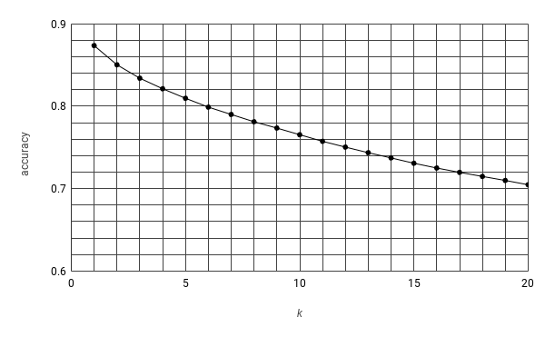

**Dataset Resource**
==========
BROWN CORPUS

A Standard Corpus of Present-Day Edited American
English, for use with Digital Computers.

by W. N. Francis and H. Kucera (1964)
Department of Linguistics, Brown University
Providence, Rhode Island, USA

Revised 1971, Revised and Amplified 1979

http://www.hit.uib.no/icame/brown/bcm.html

Distributed with the permission of the copyright holder,
redistribution permitted.

**Tunning K-Smoothing:**
============
I simply tried *k = 1* to 20 and observed a descending trend in accuracy as increasing k. According to results (below), accuracy was optimized to **87.349%**, with *k = 1*.

